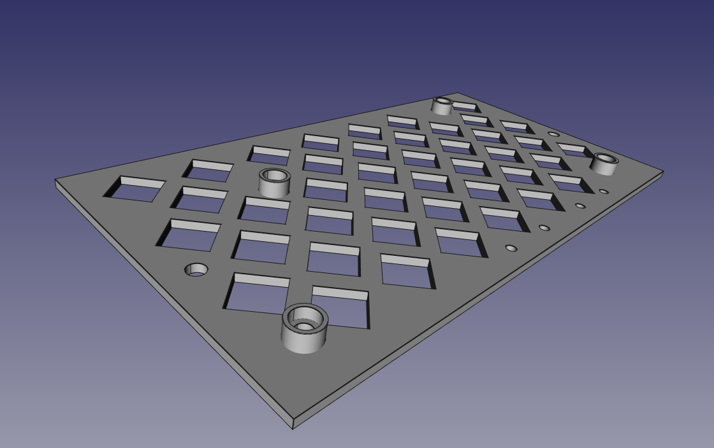

# ffcx-skr-pro-mount

This is a mounting bracket to adapt the FlashForge Creator X Mightyboard
mount to the BTT SKR Pro 1.1. It is part of an upgrade that includes
TMC 2209 stepper drivers and a BTT TFT35 V3 display.

 
This work is licensed under a
<a rel="license" href="http://creativecommons.org/licenses/by-sa/4.0/">
Creative Commons Attribution-ShareAlike 4.0 International License</a>.

## Description

The FlashForge Creator X has a unique mounting opportunity for the
Big Tree Tech SKR Pro v1.1 board.  The outer mounting posts used to
mount the metal shield over the Mightyboard line up perfectly with the
mounting holes of the SKR Pro v1.1.  We just need to change each of the
two M3x50mm standoffs to two 20mm and an 8mm standoff.

This board mounts on top of the left 4 Mightyboard mounting posts on
the FFCX.  It provides two holes to put M3x5mm brass or nylon
standoffs for the other two SKR Pro v1.1 mounting holes.

This also adds 4 holes for M2 standoffs designed to fit two Adafruit
MAX31855 thermocouple amplifier boards.  This eliminates the need to
swap out the heater blocks and install thermistors.

A word of warning: use nylon M3 screws to fasten the adapter to the
printer.  The screw heads are very close to the circuit board and
a short could severely damage the electronics and stepper motors.

